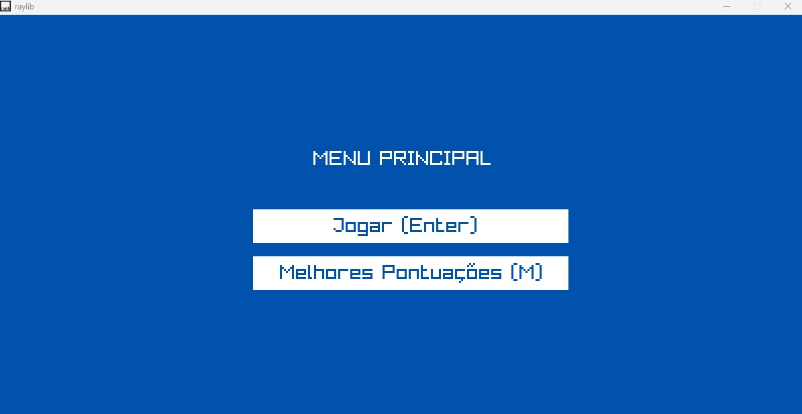
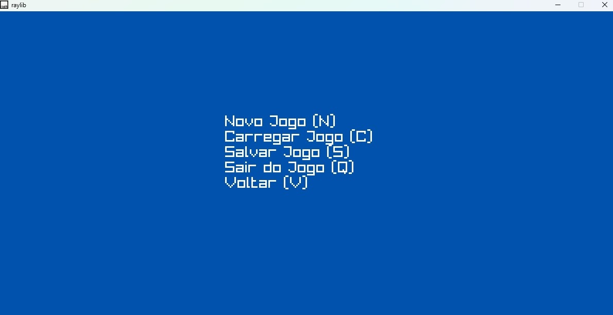

# 🎮 Super Bombinho Adventures

Um jogo no estilo **Bomberman**, desenvolvido em **C** com a biblioteca [Raylib](https://www.raylib.com/), como projeto acadêmico para a disciplina de Programação.  
O objetivo é coletar chaves, destruir obstáculos e derrotar inimigos usando bombas — tudo enquanto se esquiva das explosões e sobrevive para avançar de fase.

---

## 🖼️ Capturas de Tela

### Menu Principal

### Gameplay

### Tela de Pausa

---

## 🚀 Como Jogar
- **Movimentar:** W, A, S, D  
- **Plantar bomba:** Espaço  
- **Pausar jogo:** TAB  
- **Objetivo:** Coletar 5 chaves para avançar de nível e derrotar todos os inimigos.

---

## 📦 Execução
- O repositório já contém uma build para **Windows**.
- Para outros sistemas, compile usando o **Makefile** incluso ou através dos atalhos configurados no VSCode.
- Necessário ter a [Raylib](https://www.raylib.com/) instalada para compilação.
