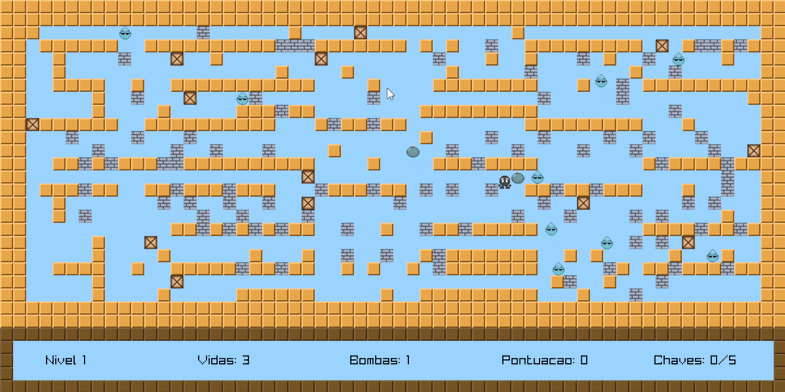

# 🎮 Super Bombinho Adventures

Um jogo no estilo **Bomberman**, desenvolvido em **C** com a biblioteca [Raylib](https://www.raylib.com/), como projeto acadêmico para a disciplina de Programação.  
O objetivo é coletar chaves, destruir obstáculos e derrotar inimigos usando bombas — tudo enquanto se esquiva das explosões e sobrevive para avançar de fase.

---

## 🖼️ Capturas de Tela

### Menu Principal


### Gameplay


### Tela de Pausa


---

## 🚀 Como Jogar
- **Movimentar:** W, A, S, D  
- **Plantar bomba:** B  
- **Pausar jogo:** TAB  
- **Objetivo:** Coletar 5 chaves para avançar de nível e derrotar todos os inimigos.

---

## ⚙️ Principais recursos técnicos
- **Linguagem:** C
- **Biblioteca gráfica:** Raylib
- **Organização modular:** código dividido em múltiplos arquivos `.c` e `.h` (bombas, jogador, inimigos, mapas, sons, paredes destrutíveis).
- **Gerenciador de estados:** `MENU`, `GAMEPLAY`, `PAUSE` e `END_GAME`.
- **Sistema de persistência:** salvar e carregar jogo em arquivo binário.
- **IA simples para inimigos:** movimento aleatório dentro dos limites do mapa.
- **Detecção de colisão:** entre jogador, paredes, inimigos e explosões.
- **Áudio:** efeitos e música extraídos do [Pixabay](https://pixabay.com/).

---

## 📦 Execução

### Windows
- O repositório já contém uma build executável (`.exe`).
- Para compilar, abra o projeto no VSCode e use os atalhos configurados ou o comando:

```bash
gcc src/*.c -o bombinho.exe -lraylib -lopengl32 -lgdi32 -lwinmm
```

### Linux
- Para compilar o projeto no Linux, certifique-se de ter o gcc e a biblioteca raylib instalados.
- Use o seguinte comando no terminal dentro da pasta do projeto:
```bash
gcc src/*.c -o bombinho -lraylib -lm -ldl -lrt -lX11 -pthread
```
- Depois de compilado, execute o programa com: 
```bash
./bombinho
```

